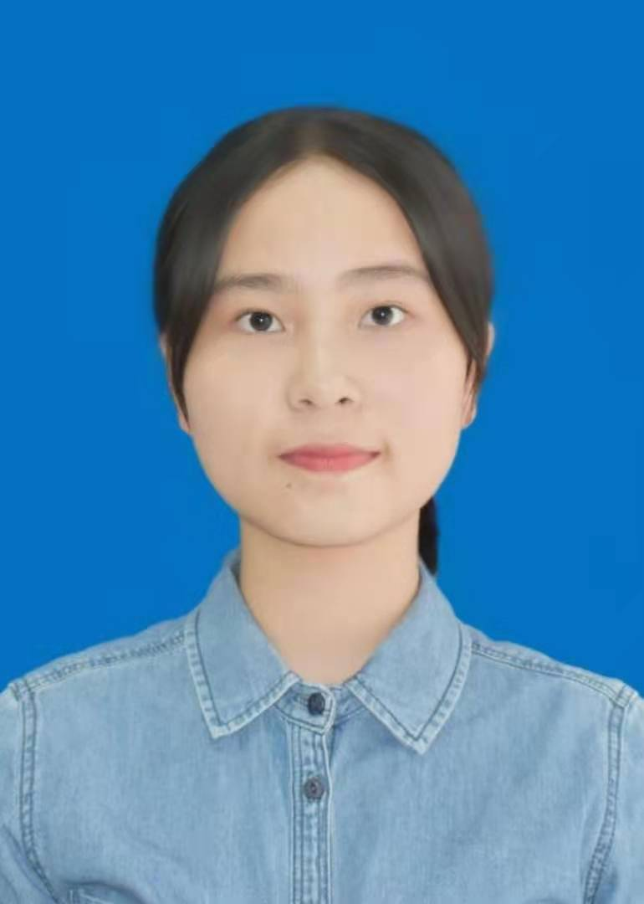

### Hi there 👋

<!--
**Alkaid3118/Alkaid3118** is a ✨ _special_ ✨ repository because its `README.md` (this file) appears on your GitHub profile.

Here are some ideas to get you started:

- 🔭 I’m currently working on ...
- 🌱 I’m currently learning ...
- 👯 I’m looking to collaborate on ...
- 🤔 I’m looking for help with ...
- 💬 Ask me about ...
- 📫 How to reach me: ...
- 😄 Pronouns: ...
- ⚡ Fun fact: ...
-->

# 陈艾茹

<!------>

## 个人介绍

| 👧🏻**19 岁** |    ☎**18579512758**     |
| :---------: | :---------------------: |
| 🌏 **武汉** | 📧**1262540487@qq.com** |

## 教育经历

#### 2021.09-2025.06 华中师范大学 计算机科学与技术 本科

- 主修课程：数据库原理（93.6/100）、人工智能（94.2/100）、面向对象程序设计（91.0/100）、Python 程序设计（91.0/100）、离散数学（92.2/100）等。

## 所获荣誉

- 2022-2023 年度校级学习积极分子；
- 2022 年度湖北省“百生讲坛”院级一等奖、校级优秀奖；
- 2021 级本科生产实习优秀个人奖；
- 2021 级学生军训“军训优秀学员”;
- 2021-2022 年度华中师范大学“星光计划”学生骨干训练营优秀营员;

## 校园经历

- #### 2022.03-至今 计算机学院 2103 团支部 团支书

  1. 组织开展团日活动、青年大学习等，促进同学们提高政治素养；
  2. 管理交接入团入党相关事宜，为班级同学们提供服务；

- #### 2021.10-2022.10 华中师范大学校学生会 权益服务中心营员

  1. 参与民管会、社工委、校园文化节、十佳美食评选等工作，保障学生权益;
  2. 参加相关培训，掌握推文制作、公文写作、ps、摄像等技能;

## 专业技能

- 熟悉 C、C++、Python、Java、SQL 等编程语言;
- 熟悉 html+css+js 前端开发;
