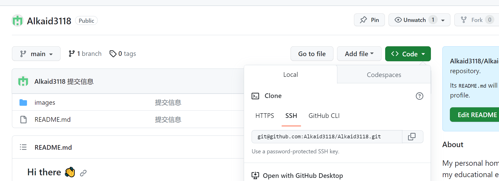
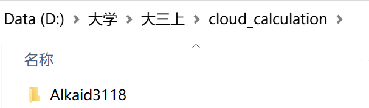
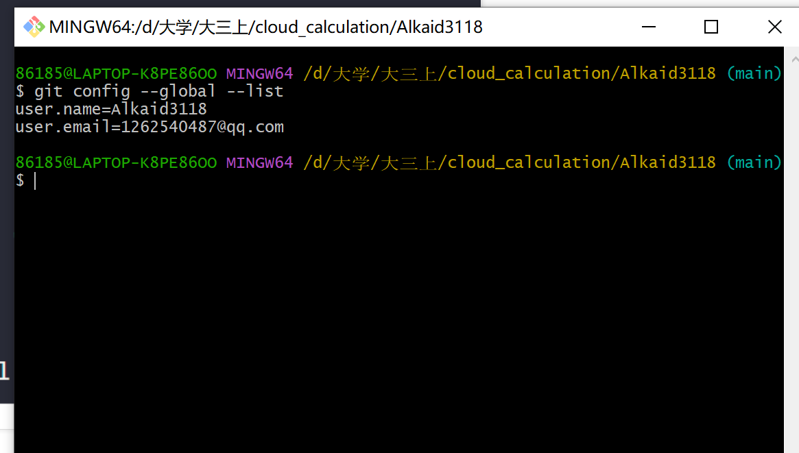

# 熟悉 Git 版本控制系统的使用

### 代码仓库初始化

初始化就是在 Github 里面创建一个新仓库（new repository）

然后给仓库命名，记得 Add a README file

### 了解 git clone、git commit 等基本操作

- #### git clone 操作

  1. 找到仓库的 SSH 并复制

     

  2. 如果我们想要把仓库内容拷贝到某个根目录下，举例如 cloud-calculation 文件夹，只需要右击 cloud-calculation 文件夹然后点击 git bash here，然后 git clone ssh 的内容即可（右键 paste），就从 GitHub 上将这个仓库文件夹拷贝到 cloud-calculation 文件夹中了。

     

- #### git commit 操作

  1. 右击仓库名的文件夹 git bash here
  2. git add（空格）.
  3. git commit -m "提交信息"（此时本地仓库内容已缓存）
  4. 此时再 git push 就更新到 GitHub 上对应的仓库了

### 在 Git 中设置提交者身份（username 和 email 等），了解基于提交者身份的代码溯源方法

git 设置提交者身份是在一开始时就设置的，username 和 email，可以用 git config --global --list 命令查看全局配置。

